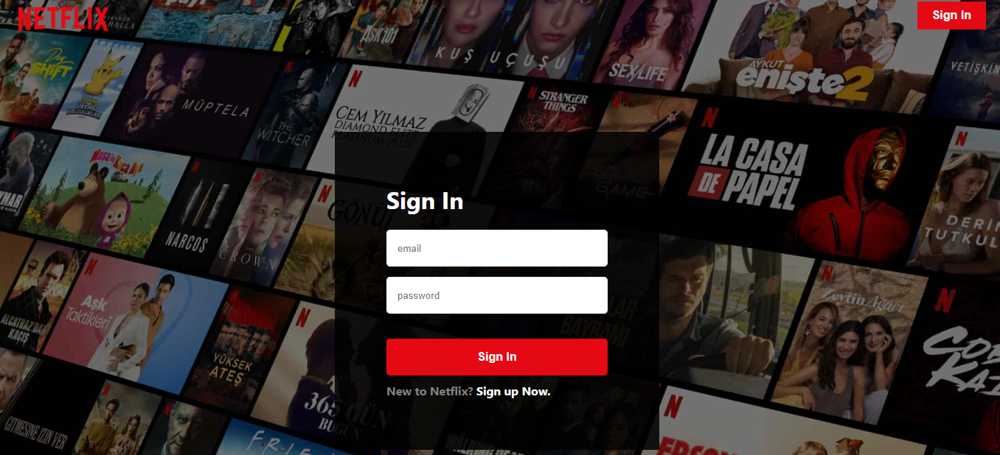

# About
The Netflix-Clone web app is a clone of the real Netflix Application to a certain extent. The clone has a similar landing page to that of Netflix and it also allows users to sign up using (*@gmail.com*) extension and view the trailers of the movie posters rendered there. 

### How to interact with the Application?

1. #### Below is the landing page you will be welcomed with when you click on the link provided in the Description section.

You can right away sign in if you have already signed up using either *Get Started* button or *Sign In* button in the top right corner. 

2. #### Once you clicked sign in you will be taken to this page.

In here, enter your preferred email id and password [remember the email id should be of the @gmail.com extension] the click on the *Sign up Now* link provided to 
sign up as a new user. 

3. #### Once you signed in you will directly taken to the HomeScreen where you can view all of the movie posters and play trailers of the movie if it is available. 

4. #### The Netflix Logo in the top right corner of the HomeScreen will take you to the ProfileScreen

This Screen is not effectively interactive as of now except that you can sign out using the *Sign Out* button provided. 

### TechStacks used to build this Application

1. React JS
2. Firebase
3. Redux
4. TMDB API
